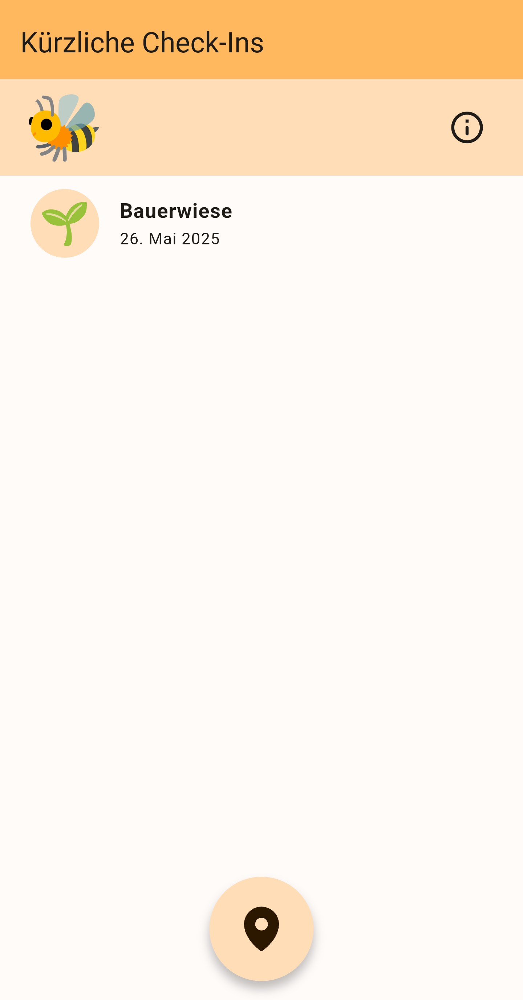
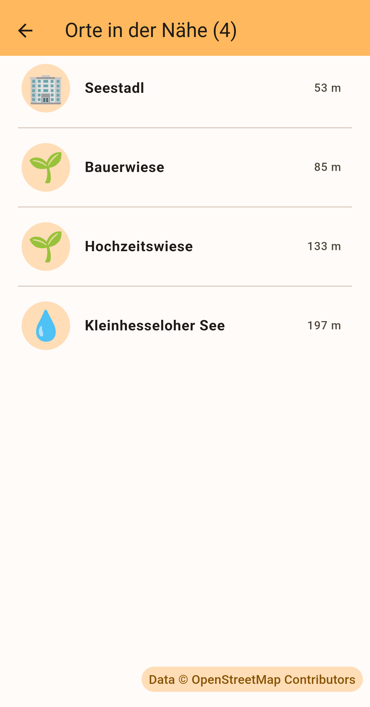

  
    
  

# LOCIDOKO

Locidoko is a companion app which allows you to show your followers in the Fediverse where you are.

The name "Locidoko" is derived from Latin "locus" (translated to "place") and Japanese "どこ" ("doko", translated to "what place").

With Locidoko you can "check in" to places around you and post your checkin to Mastodon or a compatible service in the Fediverse.

  
  

## How does it work

After connecting the app to your Mastodon account, you can get an overview of places around you. To find these places, the app calls a
preconfigured endpoint of the Overpass Turbo API of OpenStreetMap with the precise location of your device.

You can pick one of the places and "check in" with a comment and an optional photo. This "check in" is then posted as status message to your
Mastodon account. The posts are always public and unlisted, it's not possible to change the visibility.
This is by design - if you are in doubt if checking in to a place should be shown to your followers or not - it's better to not check in :)
Always keep your privacy in mind and remember that the posts are public, even "private" posts don't exist in reality.

Locidoko shows recent check-ins on its start page. Check-in posts are identified by the globe emoji, that's how the app can filter them out.
Due to search limits, not all check-ins might be shown. Always use the Mastodon front end to see all your posts/check-ins and delete/edit
them if necessary.
Locidoko is meant to be an additional service app to quickly show others where you are. It's not useful to manage your posts or your account.

By long pressing a checkin or a place, you can open additional details.

The Overpass Turbo API endpoint can be changed manually on the Info page of the app.

## Background

Writing this app was an attempt to try out Flutter and Dart and collect some experience with it by using various AI services (Copilot, Perplexity, Windsurf, ...).

It was written just for fun for personal use. But perhaps it's useful for others as well.

Please use at your own risk and always make sure that you really want to share your location.

## Overpass API

The API end point can be changed in the app on the info page.

Available end points can be found at https://wiki.openstreetmap.org/wiki/Overpass_API#Public_Overpass_API_instances in the OpenStreetMap wiki.

## Build

The app is only developed for Android. To build it on Linux follow these steps.

- Setup Flutter environment with Flutter SDK, Android Studio and VS Code. See https://docs.flutter.dev/get-started/install

- Create a keystore properties file in your home folder in `~/.keystore/key_locidoco.properties`.
  Instructions can be found in the [Flutter Docs](https://docs.flutter.dev/deployment/android#signing-the-app).

- Run `flutter build apk --release --split-per-abi --split-debug-info=build/app/outputs/symbols`

- The built apks can be found in the `build/app/outputs/flutter-apk` folder.
